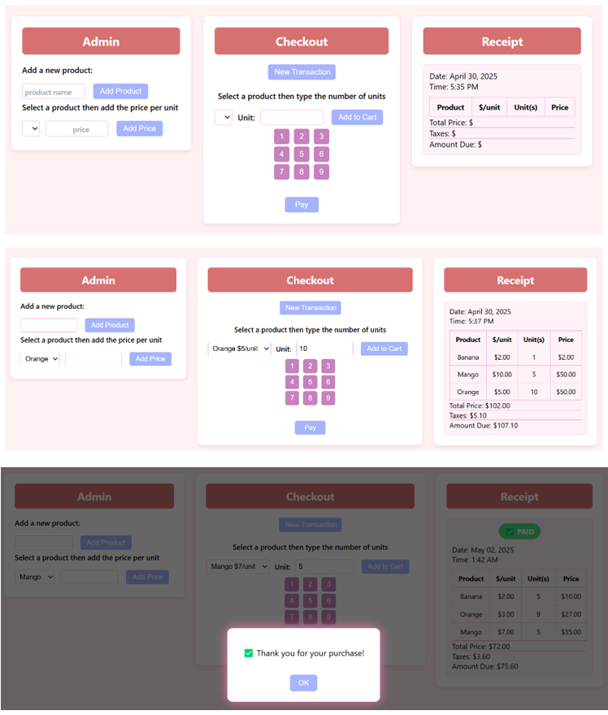

# CashierCalculator

🎮LIVE DEMO:
https://hyunjungjeinlim.github.io/CashierCalculator/

🖼️ Previeew Image

📋 Description
- A sleek, responsive cashier simulator built with HTML, CSS, JS. Add products, assign prices, select quantities, and generate a professional-style receipt.
  Designed for mobile and desktop with enhanced UX features.

✨ Features
- Add Products – Register new items dynamically  
- Set Prices – Assign price-per-unit for each product  
- Quantity Selection – Choose units via number pad or manual input  
- Live Receipt – View real-time breakdown with subtotal, tax, and total due
- Payment Modal – Displays custom "Thank You" popup on payment  
- PAID Badge – Visually marks the receipt as paid after transaction  
- Auto Date/Time – Live date and time stamp on every receipt
